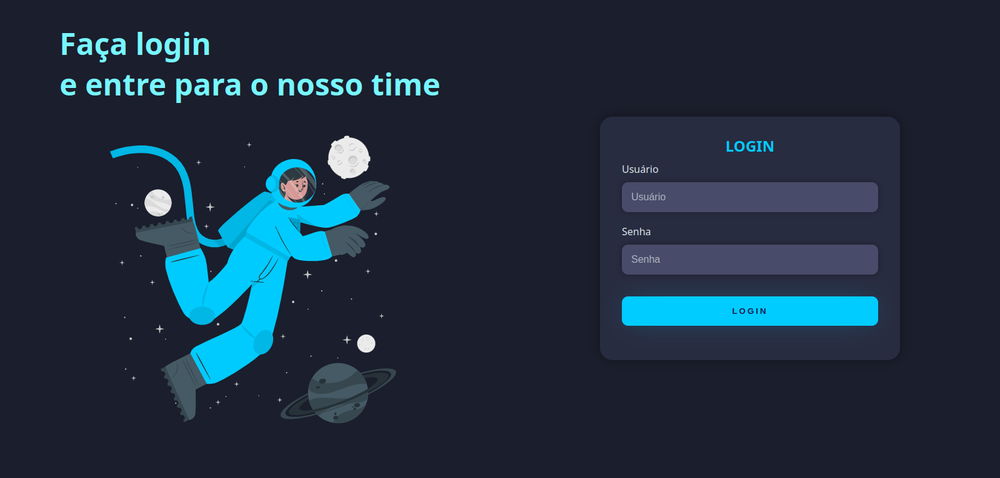

    <h1>Dark Theme Login</h1>
    
A dark themed responsive login page

    </img>

 

    
<small><strong>Build with:</strong></small>
        
        
    

[)](https://www.linkedin.com/in/dkat-davi/)

